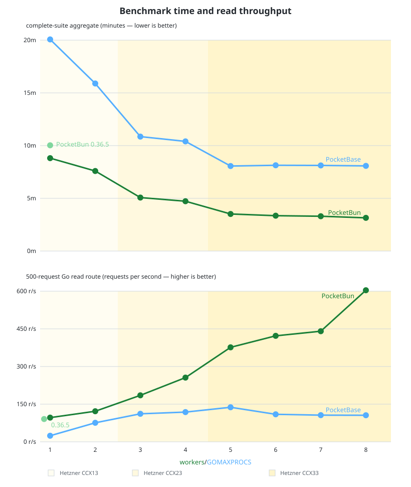

# PocketBun

[](https://github.com/pekeler/pocketbun/actions/workflows/ci.yml)
[](https://github.com/pekeler/pocketbun/releases/latest)

PocketBun is a port of [PocketBase](https://pocketbase.io) to TypeScript/Bun.

> PocketBase is an open source Go backend that includes:
> 
> - embedded database (_SQLite_) with **realtime subscriptions**
> - built-in **files and users management**
> - convenient **Admin dashboard UI**
> - and simple **REST-ish API**
>
> PocketBase © 2022–present Gani Georgiev.

## Why?

PocketBase is a well-designed, self-hosted Backend-as-a-Service. You can extend it with Go and JavaScript, but the embedded JS engine has limited ES6/Node compatibility, making customizations difficult.

PocketBun is a semi-automated port that aims for maximum compatibility with PocketBase’s API and behavior while taking full advantage of everything that [Bun has to offer](https://bun.com). It's a version of PocketBase that feels native to JS/TS developers.

## Warning

PocketBase is still under active development and NOT recommended for production. Naturally, the same applies to PocketBun.

## Docs

[PocketBun docs](https://pekeler.github.io/pocketbun/)

## Installation

`bun add pocketbun` to add to an existing project, or `bun create pocketbun my-app` to create a new project.

PocketBun requires Bun `v1.4.0` or newer.

## Quick Start

Create a small server script (for example `server.ts`):

```ts
import { BaseApp, serveAsync } from "pocketbun";

const app = new BaseApp({ dataDir: "pb_data" });
await serveAsync(app, { httpAddr: "127.0.0.1:8090" });
```

Run it:

```sh
bun run server.ts
```

Then visit `http://127.0.0.1:8090/_/` for the Admin UI and `http://127.0.0.1:8090/api/health` for a basic API response.

## Vertical Scaling

For read-heavy deployments with spare CPU capacity, start multiple workers:

```sh
bun run pocketbun --workers=4 serve --http=127.0.0.1:8090
```

On Linux, workers share the configured address. On macOS and Windows, they use consecutive loopback ports behind a reverse proxy. See the [production guide](docs/users/going-to-production.md#using-multiple-workers) for worker sizing, reverse-proxy configuration, and operational details.

## Examples

- `examples/simple` — minimal server start
- `examples/advanced` — hooks, migrations, auth, CRUD, files, realtime, and custom routes

## Performance

PocketBun `0.40.0-pocketbun.0` is benchmarked against PocketBase `v0.40.0` with Bun `1.4.0` and Go `1.27.0`. On aggregate, PocketBun is significantly faster than PocketBase.



Benchmark setup:

- complete 150-scenario PocketBase project benchmark suite (`create`, `auth`, `search`, `custom`, `delete`)
- three runs per runtime/configuration; each value is the sum of the 150 per-scenario medians, rather than one wall-clock suite run
- dedicated external load generator; the same discarded 1,000-request warmup is applied to both systems, but PocketBun needs it to reach its JIT-optimized performance while it does not materially affect PocketBase
- PocketBase uses `GOMAXPROCS=N`; PocketBun uses `--workers=N`
- the 1/2, 3/4, and 5–8 worker/GOMAXPROCS measurements use Hetzner CCX13, CCX23, and CCX33 hosts respectively

Phase detail (PocketBase / PocketBun seconds):

| Workers / GOMAXPROCS | Create | Authentication | Read | Custom routes/hooks | Delete |
| ---: | ---: | ---: | ---: | ---: | ---: |
| 1 | 129.8 / 61.5 | 29.6 / 16.4 | 897.7 / 394.8 | 120.0 / 32.1 | 27.2 / 23.8 |
| 2 | 80.2 / 51.2 | 16.5 / 16.4 | 792.1 / 335.4 | 36.0 / 28.0 | 28.5 / 24.6 |
| 3 | 52.9 / 28.8 | 10.6 / 8.3 | 514.2 / 212.5 | 42.7 / 28.1 | 30.5 / 26.7 |
| 4 | 48.1 / 27.7 | 8.4 / 8.3 | 495.4 / 192.9 | 41.0 / 27.1 | 31.2 / 27.5 |
| 5 | 37.3 / 16.7 | 6.3 / 4.3 | 368.9 / 136.2 | 38.8 / 25.4 | 32.3 / 28.4 |
| 6 | 36.6 / 16.1 | 5.5 / 4.3 | 372.3 / 128.8 | 41.5 / 23.7 | 32.1 / 28.2 |
| 7 | 35.7 / 16.2 | 4.8 / 4.3 | 372.2 / 125.5 | 41.6 / 22.6 | 32.8 / 29.3 |
| 8 | 35.8 / 16.3 | 4.3 / 4.3 | 370.2 / 116.0 | 41.8 / 21.9 | 32.6 / 30.5 |

The benchmark suite itself has [known fluctuations](https://github.com/pocketbase/benchmarks/issues/8), so treat these numbers as directional rather than absolute.

The [full methodology, raw reports, and checksums](benchmarks/results/pb_compare_20260827T213751Z_external_scaling/summary.md) are committed with the repository.

Memory and file transfer behavior, measured locally on Apple silicon:

- Idle memory: PocketBun uses about `65 MiB` more RSS than PocketBase.
- API load: a 32-client record-list probe peaked at `198 MiB` for PocketBun versus `417 MiB` for PocketBase.
- Uploads: 64–512 MiB uploads added `15–20 MiB` RSS for PocketBun versus `86–90 MiB` for PocketBase, while PocketBun was faster in this probe.
- Downloads: 64–256 MiB downloads added at most `2 MiB` RSS for PocketBun and had comparable throughput to PocketBase, including four concurrent downloads.

## Tests

PocketBun keeps test coverage close to PocketBase and adds around 20% additional PocketBun-specific tests.

Only 2 tests didn't get ported. They are for PocketBase’s self-update command/plugin which doesn't exist in PocketBun.

All tests are passing.

## Differences

All differences to PocketBase are documented [here](https://pekeler.github.io/pocketbun/differences.html), including:

- runtime/distribution differences
- CLI defaults/path resolution differences
- async API extensions
- operational differences (thumbnails, logs, templates, SQL helpers)
- intentionally unsupported PocketBase documentation topics

## Development Setup

If you want to contribute after cloning from GitHub:

```sh
bun install
bun run upstream:sync
bun run format:fix
bun test --concurrent
bun run typecheck
bun run lint
```

Optional quick smoke test:

```sh
cd examples/simple
bun install
bun run start
```

---

