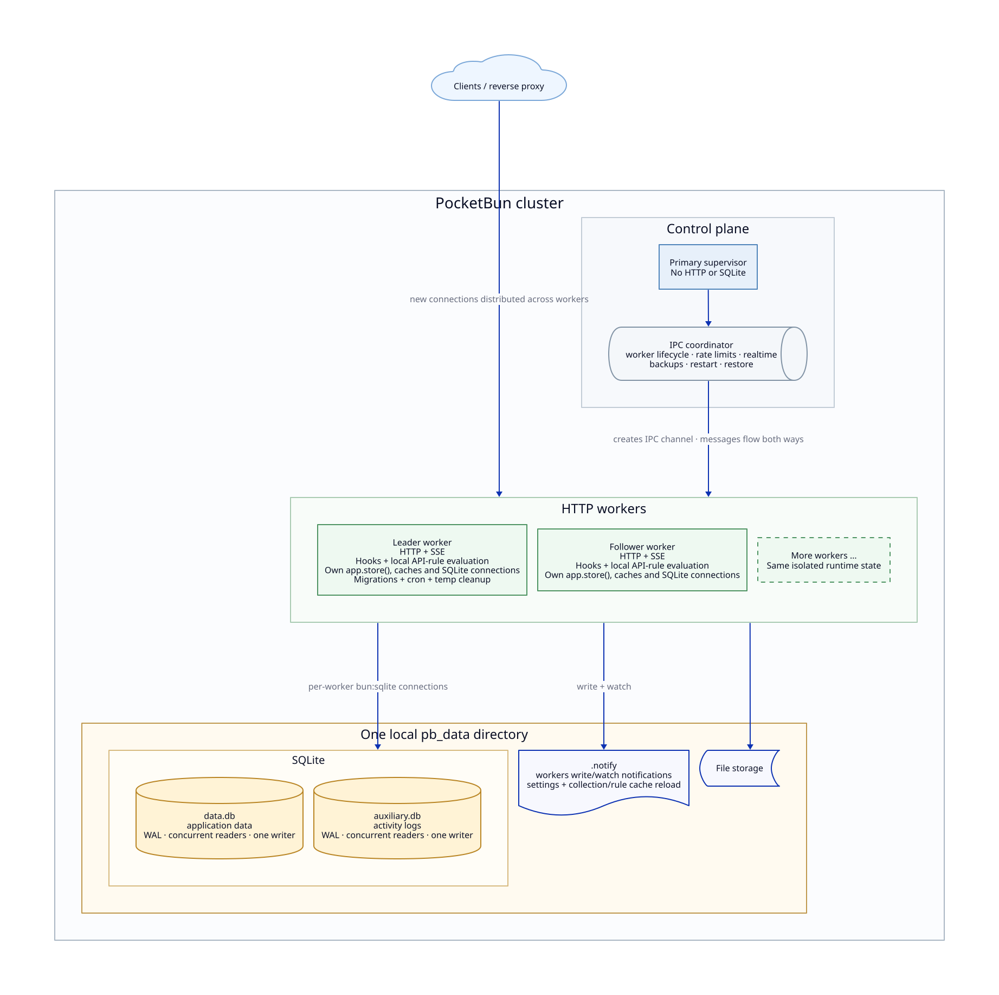
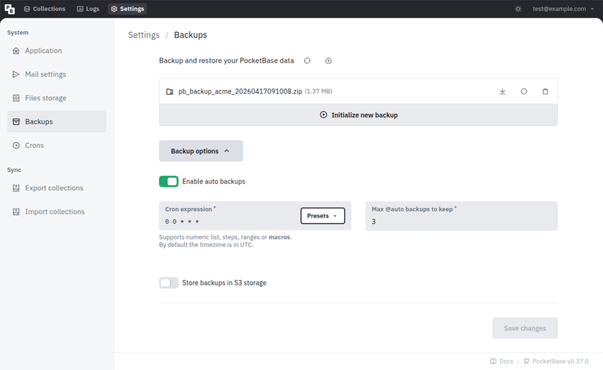
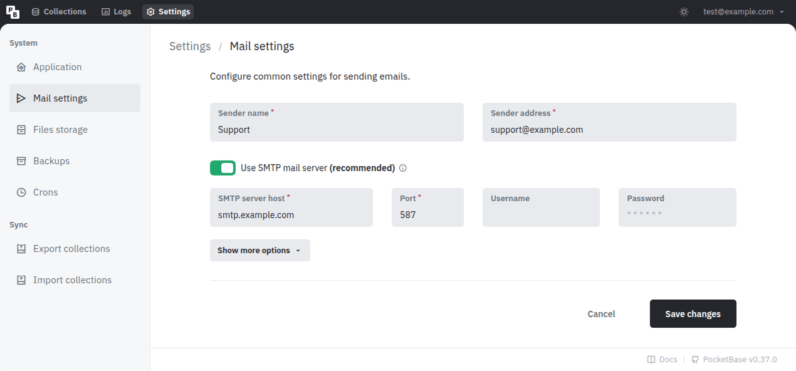
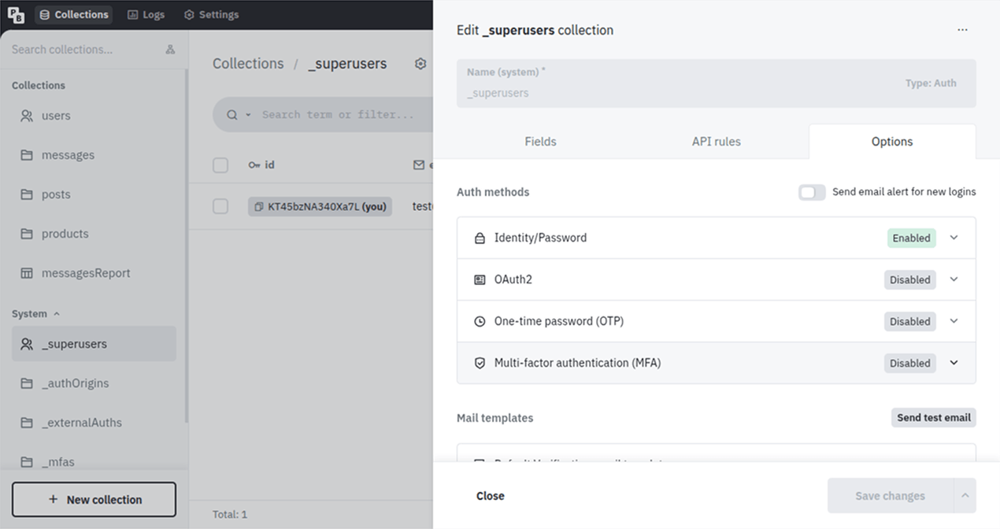
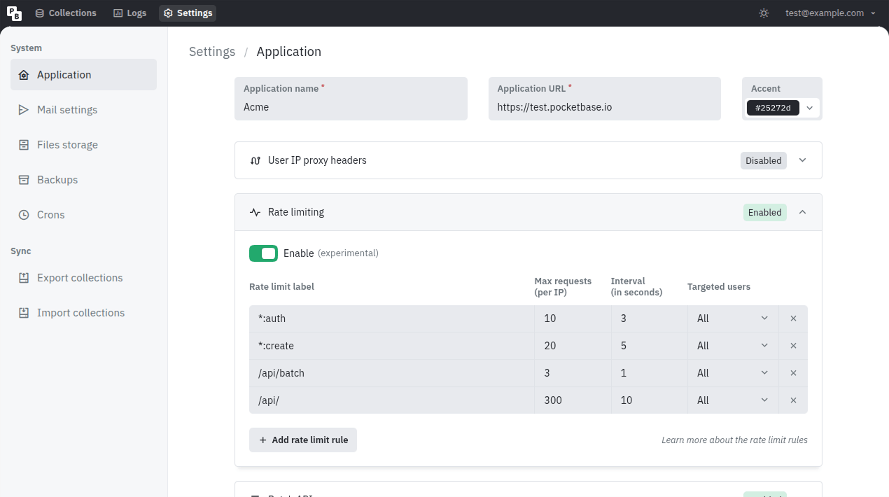

# PocketBun Going To Production

Quick links:

- [Deployment strategies](#deployment-strategies)
  - [Minimal setup](#minimal-setup)
  - [Using reverse proxy](#using-reverse-proxy)
- [Backup and Restore](#backup-and-restore)
- [Recommendations](#recommendations)
  - [Use SMTP mail server](#use-smtp-mail-server)
  - [Enable MFA for superusers](#enable-mfa-for-superusers)
  - [Enable rate limiter](#enable-rate-limiter)
  - [Increase the open file descriptors limit](#increase-the-open-file-descriptors-limit)
  - [Enable settings encryption](#enable-settings-encryption)

## Going to production

### Deployment strategies

#### Minimal setup

PocketBun needs Bun 1.4.0 or newer, your application files, and a writable `pb_data` directory. Run it as an unprivileged service on a loopback HTTP address and put a TLS-terminating reverse proxy in front of it. PocketBun does not provision HTTPS certificates itself.

A typical deployed application contains:

```text
myapp/
    bun.lock
    package.json
    pb_hooks/
    pb_migrations/
```

After copying the application to the server, install its production dependencies and verify that it starts:

```sh
cd /srv/pocketbun/myapp
bun install --production --frozen-lockfile
bun run pocketbun serve --http=127.0.0.1:8090
```

The paths and `pocketbun` account below are examples. Create `/etc/systemd/system/pocketbun.service` with the absolute Bun path reported by `command -v bun`:

```ini
[Unit]
Description=PocketBun
After=network.target

[Service]
Type=simple
User=pocketbun
Group=pocketbun
WorkingDirectory=/srv/pocketbun/myapp
ExecStart=/usr/local/bin/bun run pocketbun serve --http=127.0.0.1:8090
Restart=on-failure
RestartSec=5
LimitNOFILE=4096
KillMode=mixed
TimeoutStopSec=30

[Install]
WantedBy=multi-user.target
```

`KillMode=mixed` gives PocketBun's primary process time to shut down its workers cleanly, while ensuring systemd kills any process left after the timeout. Enable the service and inspect its logs with:

```sh
sudo systemctl daemon-reload
sudo systemctl enable --now pocketbun
sudo journalctl -u pocketbun
```

Configure a reverse proxy as shown below before exposing the application publicly. You can create the first superuser from the application directory:

```sh
bun run pocketbun superuser create EMAIL PASS
```
#### Using reverse proxy

If you plan on hosting multiple applications on a single server or need finer network controls, you can always put PocketBun behind a reverse proxy such as *NGINX*, *Apache*, *Caddy*, etc. * Just note that when using a reverse proxy you may need to set up the "User IP proxy headers" in the PocketBun settings so that the application can extract and log the actual visitor/client IP (the headers are usually `X-Real-IP`, `X-Forwarded-For`). *

Here is a minimal *NGINX* example configuration:

```html
server {
    listen 80;
    server_name example.com;
    client_max_body_size 10M;

    location / {
        # check http://nginx.org/en/docs/http/ngx_http_upstream_module.html#keepalive
        proxy_set_header Connection '';
        proxy_http_version 1.1;
        proxy_read_timeout 360s;

        proxy_set_header Host $host;
        proxy_set_header X-Real-IP $remote_addr;
        proxy_set_header X-Forwarded-For $proxy_add_x_forwarded_for;
        proxy_set_header X-Forwarded-Proto $scheme;

        # enable if you are serving under a subpath location
        #
        # note that it is better to use a subdomain when possible because of
        # the same-origin isolation for localStorage and other resources
        # rewrite /yourSubpath/(.*) /$1  break;

        proxy_pass http://127.0.0.1:8090;
    }
}
```

Corresponding *Caddy* configuration is:

```html
example.com {
    request_body {
        max_size 10MB
    }
    reverse_proxy 127.0.0.1:8090 {
        transport http {
            read_timeout 360s
        }
    }
}
```

#### Using multiple workers

PocketBun runs one HTTP process by default. For a read-heavy custom TypeScript application on a machine with spare CPU cores, set `workers` when starting the server:

```ts
await serveAsync(app, {
  httpAddr: "127.0.0.1:8090",
  workers: 4,
});
```

If you use PocketBun's included executable and `pb_hooks`, use the equivalent command-line option:

```sh
bun run pocketbun --workers=4 serve --http=127.0.0.1:8090
```

Both forms start one supervising primary process and the requested number of HTTP workers. A custom TypeScript entrypoint runs once in the primary and once in each worker, so its top-level process setup must be safe to run once per process. For systemd, configure the same `workers` value in your entrypoint or add `--workers=4` to the executable's `ExecStart` command in the minimal setup above. On Windows, use a service host or container runtime to supervise the same primary process. Do not start several independent PocketBun instances against one `pb_data` directory, and do not use cluster mode to share `pb_data` over a network filesystem between hosts. Rolling back is immediate: set `workers: 1` or `--workers=1`; it does not convert application data.

##### Cluster architecture

Cluster workers are separate operating-system processes, so they cannot share a SQLite handle. Each HTTP worker loads the same hooks, evaluates API rules locally, keeps its own `app.store()` and collection cache, and opens its own `bun:sqlite` connections to the shared local `data.db` and `auxiliary.db`. Both databases use WAL mode: readers can run concurrently, but each database still permits only one writer at a time. PocketBase's notify mechanism reloads settings and collection rules in the other workers after they change.

The primary does not serve HTTP or open the databases. It supervises workers and coordinates the small amount of cross-worker state needed for rate limiting, realtime delivery, backups, restarts, and restores. One HTTP worker is designated the leader and performs singleton work such as migrations, cron jobs, and temporary-file cleanup.



On Linux, every worker serves the configured address using the operating system's shared-port support, so an existing reverse proxy can continue to use one backend address. The operating system distributes new TCP connections among workers; each keep-alive or SSE connection stays with its assigned worker.

On macOS and Windows, workers use consecutive loopback ports instead. For example, `--workers=4 serve --http=127.0.0.1:9000` uses `127.0.0.1:9000` through `127.0.0.1:9003`. Configure every private backend in your reverse proxy and do not expose the range publicly. Replace the single-backend `proxy_pass` in the NGINX example above with:

```nginx
upstream pocketbun_workers {
    server 127.0.0.1:9000;
    server 127.0.0.1:9001;
    server 127.0.0.1:9002;
    server 127.0.0.1:9003;
}
```

Then use this inside its `location` block:

```nginx
proxy_pass http://pocketbun_workers;
```

Workers improve concurrent read throughput, but they do not make SQLite writes scale linearly because SQLite still has one writer. Each worker also has its own runtime memory and SQLite cache. Start with one worker per available vCPU, measure representative traffic and memory use, and keep `--workers=1` for small or write-heavy deployments. Use multiple client or proxy connections when measuring load so one persistent connection does not hide the available workers.

Built-in rate-limit rules remain application-wide in cluster mode; the primary batches concurrent decisions instead of multiplying each rule's allowance by the number of workers.

Each worker loads hooks and has its own in-memory `app.store()` state. Bootstrap and serve hooks therefore run once in every worker; use the database or another shared service for state that must be common to the application. Migrations, temporary-file cleanup, and scheduled cron jobs run only in the leader. Record mutation hooks run in the worker that handles the write, as with a single-process deployment. Advanced hooks can inspect `process.env.POCKETBUN_CLUSTER_ROLE` (`leader` or `follower`), `process.env.POCKETBUN_CLUSTER_SLOT`, and `process.env.POCKETBUN_CLUSTER_WORKER_ID` when a role-specific behavior is genuinely needed; do not set these internal variables yourself.

Monitor and supervise the primary process rather than individual worker PIDs. Its logs report worker lifecycle changes. It replaces an unexpectedly exited worker in the same role and slot; a repeated crash loop stops the primary with a nonzero exit so your service manager can report and restart the deployment. Continue to use `GET /api/health` through the same backend or load balancer that serves application traffic.
### Backup and Restore

To backup/restore your application it is enough to manually copy/replace your `pb_data` directory _(for transactional safety make sure that the application is not running)_.

To make things slightly easier, PocketBun v0.16+ comes with builtin backups and restore APIs that could be accessed from the Dashboard ( _Settings_ > _Backups_ ):



Backups can be stored locally (default) or in a S3 compatible storage (\*it is recommended to use a separate bucket only for the backups). The generated backup represents a ZIP archive of your `pb_data` directory, including locally stored uploads but excluding local backups and files stored in S3.

PocketBun creates disk-backed SQLite snapshots before adding them to the ZIP, so large databases are not copied into server memory. In multi-worker mode, backup, restore, and restart are coordinated across the whole application; SQLite writers can continue while a backup is generated. Keep roughly three times the size of `pb_data` free for a worst-case local backup, including the temporary snapshots and archive.

PocketBun preserves storage files deleted while the main database snapshot is created and excludes files written after that boundary. The archive therefore will not omit a local storage file referenced by the main database snapshot, although a change exactly around the boundary can leave a harmless unreferenced file in the archive.

The main and auxiliary database snapshots are each internally consistent but are captured sequentially. If your application needs one atomic boundary across both databases and every file, temporarily stop writes while creating the backup.
### Recommendations

highly recommended

#### Use SMTP mail server

By default, PocketBun uses the internal Unix `sendmail` command for sending emails. While it's OK for development, it's not very useful for production, because your emails most likely will get marked as spam or even fail to deliver.

To avoid deliverability issues, consider using a local SMTP server or an external mail service like [MailerSend](https://www.mailersend.com/), [Brevo](https://www.brevo.com/), [SendGrid](https://sendgrid.com/), [Mailgun](https://www.mailgun.com/), [AWS SES](https://aws.amazon.com/ses/), etc.

Once you've decided on a mail service, you could configure the PocketBun SMTP settings from the * Dashboard > Settings > Mail settings *:



highly recommended

#### Enable MFA for superusers

As an additional layer of security you can enable the MFA and OTP options for the `_superusers` collection, which will enforce an additional one-time password (email code) requirement when authenticating as superuser.

In case of email deliverability issues, you can also generate an OTP manually using the `pocketbun superuser otp yoursuperuser@example.com` command.



highly recommended

#### Enable rate limiter

To minimize the risk of API abuse (e.g. excessive auth or record create requests) it is recommended to set up a rate limiter.

PocketBun v0.23.0+ comes with a simple builtin rate limiter that should cover most of the cases but you are also free to use any external one via reverse proxy if you need more advanced options.

You can configure the builtin rate limiter from the * Dashboard > Settings > Application: *



optional

#### Increase the open file descriptors limit

The below instructions are for Linux but other operating systems have similar mechanism.

Unix uses *"file descriptors"* also for network connections and most systems have a default limit of ~ 1024. If your application has a lot of concurrent realtime connections, it is possible that at some point you would get an error such as: `Too many open files`.

One way to mitigate this is to check your current account resource limits by running `ulimit -a` and find the parameter you want to change. For example, if you want to increase the open files limit (*-n*), you could run `ulimit -n 4096` before starting PocketBun.

optional
#### Enable settings encryption

It is fine to ignore the below if you are not sure whether you need it.

By default, PocketBun stores the applications settings in the database as plain JSON text, including the SMTP password and S3 storage credentials.

While this is not a security issue on its own (PocketBun applications live entirely on a single server and it is expected only authorized users to have access to your server and application data), in some situations it may be a good idea to store the settings encrypted in case someone get their hands on your database file (e.g. from an external stored backup).

To store your PocketBun settings encrypted:

-
Create a new environment variable and **set a random 32 characters** string as its value.

e.g. add
`export PB_ENCRYPTION_KEY=""`
in your shell profile file

-
Start the application with `--encryptionEnv=YOUR_ENV_VAR` flag.

e.g. `pocketbun serve --encryptionEnv=PB_ENCRYPTION_KEY`

## Attribution

This page is adapted from [PocketBase docs](https://pocketbase.io/docs/going-to-production/).
